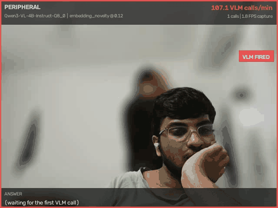
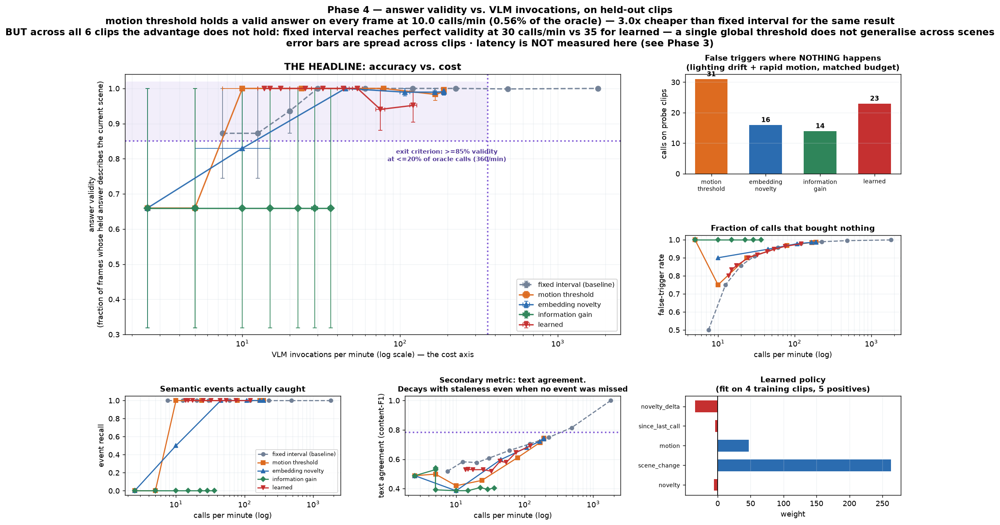
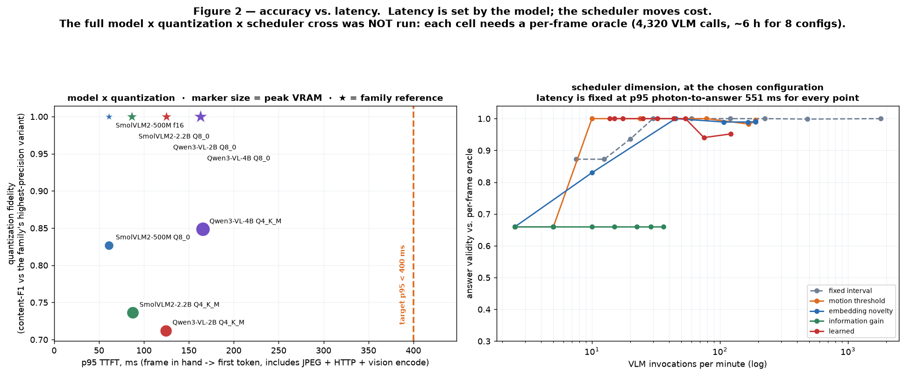

# Peripheral

**Streaming video-understanding results are reported on datacenter GPUs. Peripheral asks what you
actually get on a laptop.**

A vision-language model understanding a live camera feed at interactive speed on one consumer GPU —
an RTX 5070 Ti Laptop, 12 GB, **95 W power cap**, Windows 11 native. Every number below was measured
on that machine. Nothing is estimated.



*Object appears → novelty spikes → the VLM fires → the answer updates. HUD shows calls/min, the
novelty trace against its threshold, trigger markers, and answer staleness. Real run, real HUD.*

---

## The two figures

**Figure 1 — accuracy vs. VLM invocations.** The cost axis is what matters: answering every frame is
impossible, so the question is how few calls you can get away with.



**Figure 2 — accuracy vs. latency.** Latency is set by the model; the scheduler moves cost.



---

## What was established

| | measured |
|---|---|
| **Per-frame inference is outside the *power* envelope, not just the time budget** | 43.8 J/answer → a 30 FPS oracle needs **1,315 W against a 95 W cap** |
| Fast tier watches every frame | **4.55 ms**, 30.65 FPS live, 211 FPS unpaced, **8.2 W** |
| Slow tier meets an interactive target | **p95 photon-to-first-token 195 ms** (target 400 ms), 6.04 GB of 11.94 GB |
| Answering rarely is viable | **100% answer validity at 0.56% of the per-frame oracle's calls** (held-out) |
| A semantic cache removes more | **52.5% of remaining calls, zero false hits** |
| StreamingBench RTVU **subset** | 25/35 = **0.714** (random 0.250), 1,352 s of 1.0× replay, 0 violations |

**Watching every frame costs 8.2 W. Answering every frame costs 65.6 W and still cannot keep up.**
That gap is the entire argument for the two-tier design.

## ❗ What was *not* established

This belongs above the fold, not in a footnote.

- **That a scene-aware scheduler beats a timer.** At a matched call budget, plain `fixed_interval`
  equals or beats the embedding-novelty scheduler (validity **0.955 vs 0.941**), and is cheaper than
  every content-aware policy for perfect validity across all six clips. The *savings* are real and
  large. The claim that **embedding novelty specifically** delivers them is not supported by this
  data.
- **That the headline generalises.** A single global threshold does not transfer between scenes.
  Per-scene adaptation is the open problem this work motivates rather than solves.
- **Anything about real semantic events.** Every scheduler number rests on synthetic events
  composited onto one desk scene. The external benchmark is 7 of 500 samples, chosen shortest-first —
  **a bias that favours us**. Never quote it as a StreamingBench score.
- **OVO-Bench.** Not run: 199.6 GB as a split tar that cannot be partially extracted, against
  130 GB free. Reported as not done rather than approximated.
- **Architectural novelty.** [Dispider](https://arxiv.org/abs/2501.03218) already decomposed
  perception / decision / reaction. The contribution here is the **constraint and the measurement**,
  not the architecture.

### Two bugs are part of the result

Both survived normal operation and were caught only by tests written to attack the invariants.

1. **A timing bug under-scaled novelty 3–4×.** The fast tier's rolling reference has a half-life in
   *seconds* but was keyed off when we *read* a frame. During trace building the VLM took ~500 ms
   per frame, so frames looked 500 ms apart when they were 33 ms apart in the video. Fixing it
   **inverted the policy ranking** and **reversed the cache recommendation** from cut to keep.
2. **An ordering bug gave one query 20 ms of its own future.** The eval loop answered a query due at
   t=20.000 after processing the frame that arrived at t=20.020. Our own clips hid it — at 30 fps a
   frame lands exactly on every 2 s query, so the check passed on arithmetic luck.

Full detail in [RESULTS.md](RESULTS.md) §4 and §6.

---

## How it works

```
FAST TIER      every frame · 4.55 ms · 8.2 W · never blocks
               capture → motion/diff → MobileNetV3-small (ONNX CUDA) → novelty + scene-change
      ↓
SCHEDULER      novelty + time-since-call → invoke the VLM, or keep holding the current answer?
      ↓                                  ↓
SEMANTIC CACHE                     SLOW TIER
embedding-keyed answers            Qwen3-VL-4B-Instruct Q8_0 via llama.cpp
+ staleness tracking               streaming decode · 6.04 GB · p95 TTFT 163 ms
```

Threads, not processes — Windows spawns rather than forks, and a process worker would reload the
CUDA context and blow past 12 GB. **The capture thread never blocks on inference**; dropped frames
are a recorded policy decision, never an accident.

## Hardware, and why it matters

| | |
|---|---|
| GPU | RTX 5070 Ti Laptop · **11.94 GB** · sm_120 (Blackwell) · driver 592.01 |
| **Power** | **95 W enforced cap — every benchmark ran plugged in.** The energy numbers are meaningless on battery. |
| CPU / RAM | Intel Core Ultra 9 275HX · 32 GB |
| OS | Windows 11 native (10.0.26200) — not WSL |
| Stack | Python 3.12.10 · PyTorch 2.11.0+cu128 · llama.cpp `win-cuda-13.3` · onnxruntime-gpu 1.26 |

Two measurement caveats that apply everywhere:

- **`t0` is when OpenCV returns the frame**, not photon arrival. Sensor and USB latency is an
  unmeasured constant offset, so every latency here is a **lower bound**.
- **The webcam trades frame rate for exposure as the room darkens** — measured 30 → 19.9 → 10 FPS
  across one evening, silently. All benchmarks pin exposure; dark runs are flagged `too_dark` in
  their metrics file rather than being reported as valid.

## Prior art

We are not novel in architecture, and the README will not pretend otherwise.

| | | hardware |
|---|---|---|
| [Dispider](https://arxiv.org/abs/2501.03218) | perception / decision / reaction decomposition | n/s |
| [StreamingVLM](https://arxiv.org/abs/2510.09608) | streaming-aligned KV cache | **H100, 8 FPS** |
| [LiveVLM](https://arxiv.org/abs/2505.15269) | training-free KV compression + retrieval | n/s |
| [ViCoStream](https://arxiv.org/abs/2606.19849) | stage-wise coordinated inference | **A100, 134 FPS** |
| [CodecSight](https://arxiv.org/html/2604.06036v3) | codec-guided pruning, 87% compute cut | n/s |
| [Virtuoso](https://dl.acm.org/doi/full/10.1145/3564289) | energy-latency-accuracy Pareto | SoC |

Dispider's decision module is a learned trigger, which is what our `learned` policy is. **What is
missing from all of them is a laptop**: nobody reports photon-to-answer latency including capture,
or energy per query against a power cap, on consumer hardware. That gap is the contribution.

---

## Running it

### Setup (Windows, native)

```bash
python -m venv .venv
.venv/Scripts/python.exe -m pip install -r requirements.txt --extra-index-url https://download.pytorch.org/whl/cu128
```

Then fetch the pinned llama.cpp build and the chosen model (~5.4 GB). The script is idempotent and
verifies what it fetched:

```bash
.venv/Scripts/python.exe scripts/fetch_assets.py
```

It pins the `win-cuda-13.3` asset, **not 12.4** — this GPU is sm_120 and CUDA 12.4 predates
Blackwell — and pins the release tag, because a floating `latest` would change the binary underneath
a set of published measurements. `--check` verifies an existing setup without downloading anything.

```bash
.venv/Scripts/python.exe -m pytest tests/ -q
```

Tests needing a GPU, a camera or model weights are marked and skip cleanly without them:

```bash
.venv/Scripts/python.exe -m pytest tests/ -q -m "not gpu and not webcam and not vlm and not slow"
```

### The live demo

```bash
.venv/Scripts/python.exe -m peripheral.cli.demo --duration 120 --metrics-out results/demo.json
```

### Every runnable takes the same three flags

`--duration N --headless --metrics-out path.json` — bounded, writes metrics, exits 0. If a change
cannot be validated by a bounded headless run producing numbers, it is not done.

```bash
.venv/Scripts/python.exe -m peripheral.cli.replay_eval --duration 40 --headless \
    --metrics-out results/replay.json -o phase6.clip=data/eval_clips/mixed.mp4
```

## Docker: the eval path only — and why

`docker compose -f docker/docker-compose.yml up eval` runs the correctness gate on CPU.

**There is deliberately no demo container.** The live demo needs a webcam, and USB passthrough into
a WSL2-backed container needs usbipd-win plus a v4l2 shim — after which `CAP_DSHOW`, the backend
chosen on measured jitter, does not exist. The slow tier needs a specific CUDA build and a 95 W cap.
A container that *looked* like it reproduced the numbers on other hardware would be worse than none.

So the container reproduces what is genuinely portable: the replay harness, the policies, the
simulator, the schema. **It gates correctness, not performance.** Same for CI, which is CPU-only and
says so in the workflow.

## Repository

```
src/peripheral/
  telemetry/   MetricsRecorder, power sampling, metrics schema   [LOAD-BEARING]
  runtime/     BoundedRunner — the --duration/--headless/--metrics-out contract
  capture/     webcam / file (wall-clock paced) / synthetic sources
  pipeline/    threaded stages, bounded queues, backpressure policy
  fasttier/    encoders + motion/novelty/scene-change scoring
  scheduler/   trigger policies — the research contribution
  cache/       embedding-keyed answer cache
  vlm/         llama-server client
  eval/        annotated clips, traces, replay harness, simulators
  viz/         every figure, generated from metrics JSON
tests/         phase exit criteria, including the anti-cheat suite
```

**Every figure is regenerated from a metrics JSON.** No number in `RESULTS.md` is typed by hand into
a chart.

## Read next

[**RESULTS.md**](RESULTS.md) — every table, both bugs, the failure analysis, and §7: what this
established and what it did not.
